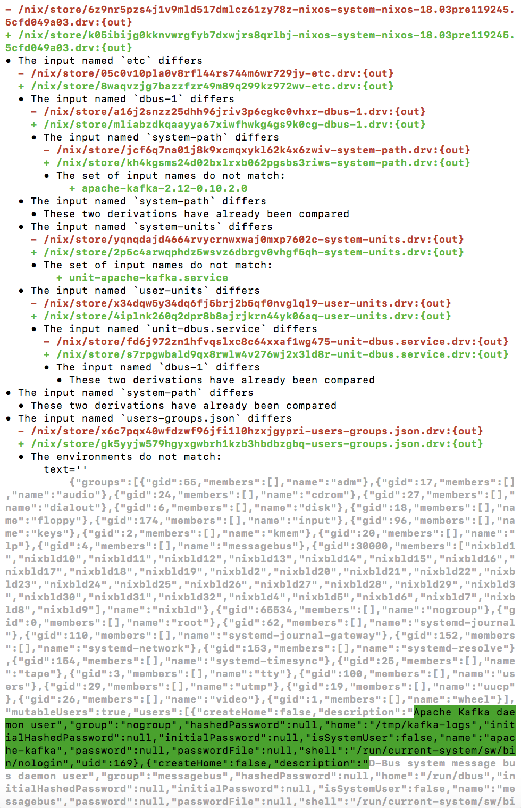

# `nix-diff 1.0.0`

This package provides a `nix-diff` executable which explains why two Nix
derivations differ.  The most common use cases for this are:

* Understanding why you have a cache miss
* Verifying a Nix change had the intended effect at the derivation level
* Improving your understanding of how Nix works

For example, consider the following Nix derivation to build a bare-bones NixOS
system:

```nix
let
  nixos = import <nixpkgs/nixos> {
    system = "x86_64-linux";

    configuration = {
      boot.loader.grub.devices = [ "/dev/sda" ];

      fileSystems."/" = {
        device = "/dev/sda";
      };
    };
  };

in
  nixos.system
```

We can use `nix-instantiate` to compute the derivation for the above file:

```bash
$ nix-instantiate example.nix  # Your exact hash might differ
warning: you did not specify ‘--add-root’; the result might be removed by the garbage collector
/nix/store/6z9nr5pzs4j1v9mld517dmlcz61zy78z-nixos-system-nixos-18.03pre119245.5cfd049a03.drv
```

Now, let's add a service to our system definition:

```nix
let
  nixos = import <nixpkgs/nixos> {
    system = "x86_64-linux";

    configuration = {
      boot.loader.grub.devices = [ "/dev/sda" ];

      fileSystems."/" = {
        device = "/dev/sda";
      };

      services.apache-kafka.enable = true;
    };
  };

in
  nixos.system
```

... and compute the derivation for the updated system:

```bash
$ nix-instantiate example.nix
warning: you did not specify ‘--add-root’; the result might be removed by the garbage collector
/nix/store/k05ibijg0kknvwrgfyb7dxwjrs8qrlbj-nixos-system-nixos-18.03pre119245.5cfd049a03.drv
```

We can use `nix-diff` to compare the two computed derivations to determine what
changed about our system:

```bash
$ nix-diff /nix/store/6z9nr5pzs4j1v9mld517dmlcz61zy78z-nixos-system-nixos-18.03pre119245.5cfd049a03.drv /nix/store/k05ibijg0kknvwrgfyb7dxwjrs8qrlbj-nixos-system-nixos-18.03pre119245.5cfd049a03.drv 
```

... which produces the following output:


